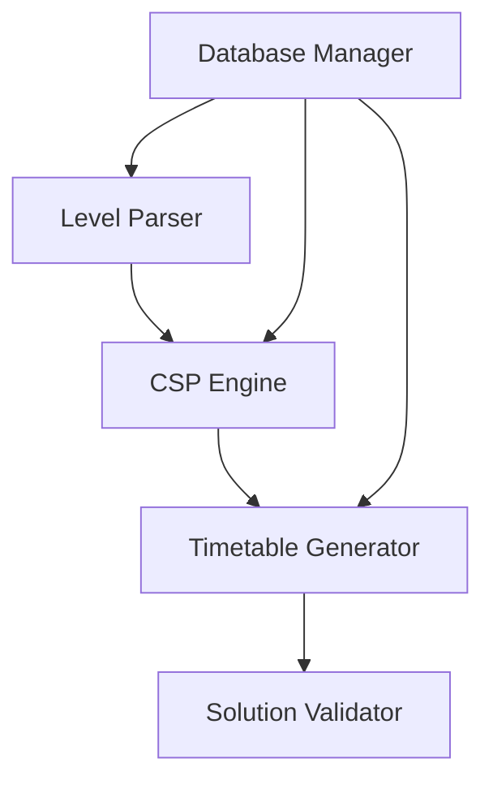

# Timetable Generator - Technical Documentation

## Architecture Overview

### System Components



### Core Components

1. **Data Layer**

   - `LevelParser`: Handles course level configuration
   - `DatabaseManager`: Manages database operations
   - `SchemaValidator`: Ensures data integrity

2. **CSP Engine**

   - `Variable`: Represents schedulable units
   - `Domain`: Manages available values
   - `ConstraintManager`: Handles scheduling constraints
   - `Solver`: Implements CSP solution algorithm

3. **Core Services**
   - `TimetableGenerator`: Orchestrates solution generation
   - `LevelScheduler`: Handles level-based scheduling
   - `SolutionValidator`: Validates generated solutions
   - `ReportGenerator`: Generates solution reports

### Data Flow

1. Configuration Loading

   ```mermaid
   sequenceDiagram
       LevelParser->>DatabaseManager: Validate courses
       DatabaseManager->>SchemaValidator: Validate schema
       LevelParser->>Domain: Initialize domains
   ```

2. Solution Generation
   ```mermaid
   sequenceDiagram
       TimetableGenerator->>LevelScheduler: Schedule level
       LevelScheduler->>Solver: Find solution
       Solver->>ConstraintManager: Check constraints
       Solver->>Domain: Update availability
   ```

### Design Patterns

- **Factory Pattern**: Creating variables and constraints
- **Strategy Pattern**: Constraint validation
- **Observer Pattern**: Domain updates
- **Command Pattern**: Database operations
